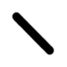
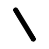
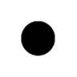

# Glifo Análise — Viabilidade Tátil para Dispositivo Matricial ELIS

Ferramenta de análise que determina a **resolução mínima de célula** (em pinos)
e a **viabilidade tátil** dos glifos da fonte **ELIS** em um dispositivo
de exibição matricial destinado à leitura pelo tato por pessoas cegas.

---

## Contexto

### Fonte ELIS (Escrita das Línguas de Sinais)

A fonte `elis.ttf` **não codifica um idioma convencional**.
Ela implementa a **notação ELIS** (Escrita das Línguas de Sinais), um sistema
desenvolvido para representar graficamente os sinais da Língua de Sinais
Brasileira (Libras) e de outras línguas de sinais.

A estratégia de armazenamento é um **mapeamento de teclado**: os codepoints
Unicode de letras latinas, dígitos e símbolos de pontuação são reutilizados
como chaves de acesso para 145 sinais gráficos distintos.
Cada "letra" digitada no teclado aciona um sinal ELIS, não um caractere de texto.

| Codepoints Unicode utilizados | Quantidade | Conteúdo em ELIS |
|-------------------------------|-----------|------------------|
| U+0041 – U+005A (A–Z)         | 26        | Sinais maiúsculos |
| U+0061 – U+007A (a–z)         | 26        | Sinais minúsculos |
| U+0030 – U+0039 (0–9)         | 10        | Sinais numéricos |
| U+0021 – U+005F (pontuação)   | 21        | Modificadores e conectores |
| U+00A0 – U+00FD (Latin-1)     | 62        | Diacríticos e sinais estendidos |
| **Total com conteúdo visual** | **145**   | |
| U+0020 (SPACE)                | 1         | Separador (sem forma visual) |

### Dispositivo alvo

Um **display matricial de pinos táteis** que eleva/abaixa pinos metálicos
ou plásticos em uma grade de $N \times N$ posições, permitindo que uma pessoa
cega toque o glifo e identifique o sinal ELIS pelo relevo.

---

## Requisitos Psicofísicos

O projeto foi dimensionado com base nos limiares de **percepção tátil dos
dedos indicador e médio** estabelecidos pela literatura especializada e pela
norma ISO 11548-2 (equipamentos em Braille).

### Limiar de dois pontos (resolução espacial do dedo)

O **limiar de discriminação de dois pontos** na ponta dos dedos é de
aproximadamente **2 a 3 mm**. Abaixo desse espaçamento, dois pinos
adjacentes são percebidos como um único ponto de pressão.

Parâmetro adotado:

$$d_{pino} = 2{,}5\ \text{mm (centro a centro)}$$

Esse valor coincide com o espaçamento Braille definido pela ISO 11548-2,
amplamente validado em dispositivos de leitura tátil.

### Tamanho máximo legível com um dedo

A leitura eficiente com **um único dedo** exige que toda a célula caiba
sob a área de contato do dedo indicador, estimada em:

$$A_{dedo} \leq 25\ \text{mm} \times 25\ \text{mm}$$

Células maiores exigem exploração com múltiplos dedos ou movimento sequencial,
aumentando o tempo de decodificação e a carga cognitiva.

### Dimensões físicas por resolução

$$L_{física}(N) = (N - 1) \times d_{pino}$$

| Resolução | Tamanho físico | Compatibilidade |
|-----------|---------------|----------------|
| **10×10** | **22,5 × 22,5 mm** | ✅ Leitura com 1 dedo |
| 15×15 | 35,0 × 35,0 mm | ⚠ Requer exploração com 2–3 dedos |
| 20×20 | 47,5 × 47,5 mm | ⚠ Requer exploração palmar |

### Parâmetros físicos do pino

| Parâmetro | Valor | Fundamento |
|-----------|-------|-----------|
| Espaçamento (centro a centro) | 2,5 mm | ISO 11548-2, limiar tátil dos dedos |
| Diâmetro do pino | 1,5 mm | ISO 11548-2 (Braille: 1,5–1,6 mm) |
| Gap entre pinos | 1,0 mm | ≥ 0,8 mm mínimo para discriminação |
| Altura mínima ativa | 0,6 mm | ISO 11548-2; detectável ao tato |

---

## Critérios de Viabilidade Tátil

Cada glifo é avaliado por **cinco critérios independentes**.
A falha em qualquer um resulta na classificação correspondente.

### 1. Tamanho físico (TAMANHO_GRANDE)

A célula não pode exceder $25\ \text{mm}$. Resoluções 15×15 e 20×20 já
falham neste critério, independentemente do conteúdo do glifo.

### 2. Densidade mínima — $\rho$ (VAZIO)

$$\rho = \frac{\sum_{i,j} B_{i,j}}{N^2} \geq \rho_{\min} = 0{,}03$$

Pinos insuficientes ($< 3\%$ da matriz) produzem uma sensação tátil
imperceptível ou idêntica a células adjacentes. Aplica-se especialmente a
sinais ELIS que possuem traços muito finos ou pontos isolados.

### 3. Densidade máxima (SATURADO)

$$\rho \leq \rho_{\max} = 0{,}55$$

Mais de 55% dos pinos ativos cria uma superfície densa sem textura
diferenciável — percebida como um "bloco liso" ao tato.

### 4. Complexidade de borda — $\varepsilon$ (RASO)

$$\varepsilon = \frac{|\{(i,j): B_{i,j} \neq \text{vizinho}\}|}{N^2} \geq \varepsilon_{\min} = 0{,}08$$

Um pixel é considerado "de borda" se seu valor difere de pelo menos um
dos quatro vizinhos adjacentes. Glifos com $\varepsilon < 0{,}08$ possuem
poucos contornos internos e tendem a ser confundidos ao tato.

### 5. Fidelidade estrutural — IoU (PERDA_ESTRUTURAL)

$$IoU(A,B) = \frac{|A \cap B|}{|A \cup B|} \geq 0{,}15$$

Onde $A$ é o bitmap de referência ($64 \times 64$, reduzido para $N \times N$
via filtro LANCZOS + rebinarização) e $B$ é o bitmap na resolução de teste.
O IoU detecta deformações graves de forma que invalidam o reconhecimento tátil.

### Tabela de veredictos

| Veredicto | Cor (grade) | Significado |
|-----------|-------------|-------------|
| **APTO** | Verde | Todos os critérios satisfeitos |
| VAZIO | Cinza | $\rho < 3\%$ — marca tátil insuficiente |
| SATURADO | Laranja | $\rho > 55\%$ — bloco indiferenciado |
| RASO | Amarelo | $\varepsilon < 8\%$ — forma sem contornos |
| PERDA_ESTRUTURAL | Vermelho | IoU < 0,15 — forma distorcida |
| TAMANHO_GRANDE | Azul | Célula excede 25 mm (múltiplos dedos) |

---

## Resultados

### Tabela geral de cobertura

| Resolução | Tamanho físico | 1 dedo | APTO | VAZIO | Outros | Cobertura útil |
|-----------|---------------|--------|------|-------|--------|----------------|
| **10×10** | **22,5 mm** | **✅** | **123** | **20** | **3** | **97,6%** |
| 15×15 | 35,0 mm | ⚠ | 0 | 1 | 145 | 0,0% |
| 20×20 | 47,5 mm | ⚠ | 0 | 1 | 145 | 0,0% |

As resoluções 15×15 e 20×20 são integralmente reprovadas pelo critério de
tamanho físico — excedem os 25 mm do campo de leitura com um dedo.

### Cobertura por grupo de glifos — 10×10

| Grupo ELIS | Aptos | Totais (exc. VAZIO) | Cobertura |
|------------|-------|---------------------|-----------|
| Maiúsculas A–Z | 26 | 26 | 100% |
| Dígitos 0–9 | 10 | 10 | 100% |
| Pontuação / Símbolos | 16 | 16 | 100% |
| Acentuados / Latin-1 | 53 | 53 | 100% |
| **Minúsculas a–z** | **18** | **21** | **86%** |

As minúsculas a–z apresentam cobertura parcial. Cinco sinais
(b, k, m, n, q) possuem $\rho < 3\%$ na resolução 10×10 (sinais de
traço fino ou mínimo) e três (i, r, s) possuem IoU < 0,15 (deformação
estrutural ao reduzir para 10 pinos).

### Glifos com restrição em 10×10

| Codepoint | Glifo ELIS | Sinal | Veredicto | $\rho$ | IoU | $\varepsilon$ | Observação |
|-----------|:----------:|-------|-----------|--------|-----|--------------|------------|
| U+0069 (i) |  | Minúscula i | PERDA_ESTRUTURAL | 0,100 | 0,097 | 0,300 | Forma distorcida ao reduzir |
| U+0072 (r) |  | Minúscula r | PERDA_ESTRUTURAL | 0,040 | 0,000 | 0,140 | Sinal desaparece estruturalmente |
| U+0073 (s) |  | Minúscula s | PERDA_ESTRUTURAL | 0,060 | 0,143 | 0,200 | IoU marginal (0,143 < 0,15) |

Esses três sinais requerem **redesenho manual** para a grade 10×10,
simplificando ou estilizando seus traços para garantir reconhecimento tátil.

### Glifos marcados como VAZIO (ausência intencional de pinos)

Vinte codepoints produzem $\rho < 3\%$ em 10×10, incluindo: o separador
`SPACE` (U+0020) e as minúsculas abaixo:

| Codepoint | Glifo ELIS | Sinal |
|-----------|:----------:|-------|
| U+0062 (b) |  | Minúscula b |
| U+006B (k) |  | Minúscula k |
| U+006D (m) |  | Minúscula m |
| U+006E (n) |  | Minúscula n |
| U+0071 (q) |  | Minúscula q |

Esses sinais ELIS possuem geometria mínima que não produz marca tátil suficiente nesta resolução.
Para uso no dispositivo, recomenda-se ou:

- Aumentar ligeiramente o font size (ex.: usar tamanho `N`) e re-testar, ou
- Criar variantes simplificadas manuais para a grade 10×10.

---

## Recomendação Final

> **Resolução recomendada: 10×10 pinos — célula física de 22,5 × 22,5 mm**

Esta é a **única resolução** que simultaneamente:
1. Cabe sob um único dedo indicador ($22{,}5\ \text{mm} \leq 25\ \text{mm}$)
2. Atinge 97,6% de cobertura nos sinais ELIS com conteúdo visual
3. Garante cobertura total (100%) nos grupos Maiúsculas, Dígitos, Pontuação e Latin-1

Para cobertura completa dos 145 sinais, redesenhe manualmente os
**3 glifos problemáticos** (i, r, s) adaptando seus traços à grade de 10 pinos.

---

## Metodologia do Código

### Pipeline de análise

```
elis.ttf
  │
  ├─ fontTools.getBestCmap()
  │     → 146 codepoints mapeados
  │
  ├─ [Renderização de referência 64×64]
  │     Pillow FreeTypeFont → bitmap binário 0/1
  │     → GlyphProfile { density, edge_complexity, bitmap_ref }
  │
  ├─ Para cada resolução candidata (10×10, 15×15, 20×20):
  │     ├─ Calcula tamanho físico: (N-1) × 2,5 mm
  │     ├─ Para cada glifo:
  │     │     ├─ Renderiza em NxN
  │     │     ├─ Calcula ρ, ε
  │     │     ├─ Calcula IoU(ref reduzida, teste)
  │     │     └─ Emite veredicto (APTO / VAZIO / SATURADO / RASO / PERDA_ESTRUTURAL / TAMANHO_GRANDE)
  │     └─ Gera ResolutionReport + grade visual PNG
  │
  └─ [Análise Estendida — M×N × spacing sweep]
        Para cada resolução em ASYMMETRIC_RESOLUTIONS
        × espaçamento em {2,5 / 3,0 / 3,5 mm}:
              ├─ Calcula (L_cel, H_cel) por eixo
              ├─ Determina modo: 1-dedo / multi-dedo / fora-de-alcance
              ├─ Calcula K_max = ⌊(180 + 3) / (L_cel + 3)⌋
              ├─ Reutiliza análise psicofísica completa (5 critérios)
              └─ Filtra candidatos: modo OK + K≥4 + cobertura≥80%
```

### Cálculo do IoU

A referência de 64×64 é reduzida para $N \times N$ via filtro LANCZOS
(com _anti-aliasing_) seguido de rebinarização pelo threshold $> 64$,
compensando o desfoque introduzido pelo _downsampling_:

$$A_{reduzida} = \text{thresh}_{64}\left(\text{LANCZOS}_{64 \to N}(B_{ref})\right)$$

$$IoU = \frac{|A_{reduzida} \cap B_{teste}|}{|A_{reduzida} \cup B_{teste}|}$$

O IoU foi escolhido sobre a correlação de Pearson por ser robusto com
bitmaps esparsos: a correlação colapsa quando um dos vetores tem variância
próxima de zero, situação comum em sinais ELIS de baixa densidade.

### Métricas de complexidade

A complexidade de borda $\varepsilon$ captura a riqueza de contornos do glifo:
quanto maior $\varepsilon$, mais a forma possui variações internas que o dedo
pode detectar como sulcos, relevos ou transições. É calculada via detecção
de borda 4-conexa em numpy sem dependências externas:

```python
edge = (bm != up) | (bm != down) | (bm != left) | (bm != right)
ε = edge.sum() / bm.size
```

---

## Execução

```bash
uv sync                  # instala dependências e registra entry points

uv run glifo-analise     # análise completa via terminal (CLI)
uv run glifo-gui         # interface gráfica no browser (http://localhost:8080)
```

**Scripts de conveniência:**

| Script | Modo | Descrição |
|--------|------|-----------|
| `./scripts/start.sh` | Produção | Sobe o FastAPI servindo o `frontend/dist/` em http://localhost:8080 (compila o frontend automaticamente se necessário) |
| `./scripts/dev.sh` | Desenvolvimento | Sobe FastAPI (porta 8080) + Vite dev server com hot-reload (porta 5173) |

```bash
./scripts/start.sh   # produção — http://localhost:8080
./scripts/dev.sh     # desenvolvimento — http://localhost:5173 (hot-reload)
```

> **Testes:**
> ```bash
> uv run pytest                            # 146 testes (suite completa)
> uv run pytest --cov=glifo_analise        # com cobertura
> ```

Saídas geradas em `./output/`:

| Arquivo | Conteúdo |
|---------|----------|
| `tatil_<M>x<N>_<esp>mm.png` | Grade visual de diagnóstico por candidato |
| `candidatos_viaveis.json` | Lista de candidatos da análise estendida |
| `tatil_3d_<M>x<N>_<esp>mm_<seq>.<fmt>` | Modelo 3D tátil para impressão (`.3mf` ou `.stl`) |

---

## Execução via Docker (opcional)

> **Pré-requisito:** Docker ≥ 20 com o plugin `docker compose` (v5+).
> Não é necessário ter Python, Node.js ou `uv` instalados localmente.

Os arquivos de suporte estão na pasta `docker/`:

| Arquivo | Descrição |
|---------|-----------|
| `docker/Dockerfile` | Build multi-stage: Node (frontend) → Python/uv (deps) → imagem final |
| `docker/docker-compose.yml` | Orquestração do container com volume para `./output/` |
| `docker/manage.sh` | Script de gerenciamento com comandos de conveniência |
| `.dockerignore` | Exclui artefatos desnecessários do contexto de build |

### Comandos rápidos

```bash
# 1. Construir a imagem (necessário apenas na primeira vez ou após mudanças)
./docker/manage.sh build

# 2. Subir o container em background
./docker/manage.sh up
# → acesse http://localhost:8080

# 3. Acompanhar logs
./docker/manage.sh logs

# 4. Parar o container
./docker/manage.sh down
```

Ou diretamente com o Docker Compose, a partir da raiz do projeto:

```bash
docker compose -f docker/docker-compose.yml build
docker compose -f docker/docker-compose.yml up -d
docker compose -f docker/docker-compose.yml down
```

### Todos os comandos do `manage.sh`

| Comando | Descrição |
|---------|-----------|
| `build` | Constrói (ou reconstrói) a imagem Docker |
| `up` | Sobe o container em background |
| `down` | Para e remove o container |
| `restart` | Para e re-sobe o container |
| `logs` | Acompanha os logs em tempo real |
| `shell` | Abre bash dentro do container em execução |
| `status` | Exibe status e health do container |
| `clean` | Remove container + imagem + volumes |

### Arquitetura da imagem (multi-stage)

A imagem usa **3 estágios** para maximizar o cache do Docker:

```
Estágio 1 — frontend-build (node:22-slim)
  COPY package.json + package-lock.json → npm ci   ← cache se deps não mudar
  COPY src/ → npm run build → /app/frontend/dist/

Estágio 2 — python-deps (python:3.12-slim + uv)
  COPY pyproject.toml + uv.lock → uv sync --no-dev --no-install-project
  ← cache se uv.lock não mudar

Estágio 3 — final (python:3.12-slim + uv)
  COPY .venv/ do estágio 2
  COPY glifo_analise/ + elis.ttf → uv sync --no-dev  ← instala o projeto
  COPY dist/ do estágio 1
  CMD glifo-gui
```

Arquivos gerados (modelos 3D, PNGs) são persistidos em `./output/` via volume,
ficando disponíveis no host mesmo após `docker compose down`.

---

## Dependências

| Pacote | Versão | Papel |
|--------|--------|-------|
| `Pillow` | ≥ 12.x | Renderização de glifos, geração de grades |
| `fonttools` | ≥ 4.x | Leitura do `cmap` da fonte TTF |
| `numpy` | ≥ 2.x | Operações binárias (IoU, densidade, complexidade) |
| `trimesh` | ≥ 4.x | Geração e exportação de malhas 3D (STL / 3MF) |
| `networkx` | ≥ 3.x | Exigido pelo trimesh para exportação 3MF |
| `lxml` | ≥ 6.x | Parser XML para o formato 3MF |
| `fastapi` | ≥ 0.115 | Framework REST + WebSocket (backend) |
| `uvicorn` | ≥ 0.30 | Servidor ASGI (HTTP/WebSocket) |
| `python-multipart` | ≥ 0.0.9 | Upload de arquivos (FastAPI) |

**Frontend (Node.js / Vite):**

| Pacote | Versão | Papel |
|--------|--------|-------|
| `vue` | 3.5.x | Framework reativo (SPA) |
| `vue-router` | 4.5.x | Roteamento client-side |
| `pinia` | 2.3.x | Gerenciamento de estado |
| `axios` | 1.7.x | Cliente HTTP |
| `three` | 0.172.x | Visualizador 3D no browser |
| `vite` | 6.x | Bundler + dev server |

**Dependências de desenvolvimento:**

| Pacote | Versão | Papel |
|--------|--------|-------|
| `pytest` | ≥ 8.x | Suite de testes (146 testes) |
| `pytest-cov` | ≥ 5.x | Relatório de cobertura |
| `httpx` | ≥ 0.28 | Cliente HTTP para testes de API |
| `pytest-anyio` | ≥ 0.0 | Suporte async nos testes |

---

## Estrutura do Projeto

```
glifo-analise/
├── elis.ttf                  ← fonte ELIS de sinais (não é fonte de texto)
├── main.py                   ← shim CLI (aponta para glifo_analise.cli.main)
├── gui.py                    ← shim GUI (aponta para glifo_analise.gui.app)
├── pyproject.toml            ← configuração do projeto (uv)
├── glifo_analise/            ← pacote principal
│   ├── config.py             ← constantes ISO 11548-2 e grupos de glifos
│   ├── models.py             ← dataclasses: GlyphProfile, ResolutionReport, ExtendedReport
│   ├── analysis/
│   │   ├── bitmap.py         ← renderização, densidade, IoU, complexidade de borda
│   │   ├── physical.py       ← dimensões físicas, capacidade sequencial
│   │   ├── resolution.py     ← análise básica e estendida (M×N × espaçamento)
│   │   └── iso.py            ← 9 critérios ISO 11548-2
│   ├── output/
│   │   ├── grid.py           ← grade visual PNG de diagnóstico
│   │   ├── model3d.py        ← geração de STL/3MF
│   │   ├── persistence.py    ← salvar/carregar candidatos em JSON
│   │   └── preview.py        ← PNG de pré-visualização do modelo 3D
│   ├── cli/
│   │   ├── main.py           ← entry-point CLI
│   │   ├── display.py        ← tabelas e fichas de candidatos
│   │   └── prompts.py        ← fluxo interativo (lista salva, geração 3D)
│   ├── gui/
│   │   └── static/           ← viewer3d.html + Three.js (reutilizado)
│   └── api/                  ← backend FastAPI
│       ├── main.py           ← create_app(), run() — serve SPA em /
│       ├── state.py          ← AppState thread-safe (singleton)
│       ├── ws.py             ← WebSocketManager (broadcast de progresso)
│       └── routes/
│           ├── analysis.py       ← POST /api/analysis/run, GET /api/analysis/status
│           ├── candidates.py     ← GET /api/candidates, GET /api/candidates/detail/{rank}
│           ├── visualization.py  ← POST /api/visualization/generate
│           ├── model3d.py        ← POST /api/model3d/generate, GET /api/model3d/files
│           └── files.py          ← GET /output/{filename}
├── frontend/                 ← SPA Vue 3 + Vite
│   ├── src/
│   │   ├── main.ts
│   │   ├── App.vue           ← layout principal com nav tabs
│   │   ├── router/index.ts
│   │   ├── stores/           ← analysis.ts, candidates.ts, model3d.ts (Pinia)
│   │   └── views/            ← AnalysisView, CandidatesView, DetailView, VisualizationView, Model3DView
│   ├── public/static/        ← viewer3d.html + Three.js + elis.ttf
│   └── dist/                 ← build de produção (gerado por `npm run build`)
├── tests/                    ← 146 testes (TDD Red-Green-Refactor)
│   ├── conftest.py
│   ├── test_bitmap.py
│   ├── test_config.py
│   ├── test_grid.py
│   ├── test_iso.py
│   ├── test_models.py
│   ├── test_persistence.py
│   ├── test_physical.py
│   ├── test_preview.py
│   ├── test_resolution.py
│   ├── test_api_analysis.py
│   ├── test_api_candidates.py
│   ├── test_api_visualization.py
│   └── test_api_model3d.py
├── docker/                   ← suporte a execução em container (opcional)
│   ├── Dockerfile            ← build multi-stage (Node → Python/uv → final)
│   ├── docker-compose.yml    ← orquestração do container
│   └── manage.sh             ← script: build / up / down / logs / shell / clean
├── .dockerignore             ← exclui artefatos do contexto de build
├── specs/                    ← especificações do projeto
│   ├── requirements.md
│   ├── architecture.md
│   └── roadmap.md
└── output/                   ← arquivos gerados em runtime
    ├── tatil_<M>x<N>_<esp>mm.png
    ├── candidatos_viaveis.json
    └── tatil_3d_<M>x<N>_<esp>mm_<seq>.3mf
```

---

## Geração de Protótipo 3D Tátil

A partir de qualquer candidato da lista salva, o sistema pode gerar um
modelo 3D imprimível (.3mf ou .stl) representando uma **tira de glifos ELIS
com pinos em relevo**, pronta para prototipagem em impressora FDM.

### Fluxo interativo (CLI)

Após selecionar um candidato da lista e gerar a grade visual, o sistema pergunta:

```
Deseja gerar modelo 3D tátil para impressão? [S/n]:
Sequência de glifos ELIS [tqlDà]:        ← Enter usa o padrão
Formato [3mf/stl, padrão 3mf]:
```

O mesmo prompt aparece ao final da **análise completa**, sobre o melhor
candidato sequencial encontrado.

### Geometria do modelo

O modelo é composto por:

- **Placa-base** retangular de 2,0 mm de espessura;
- **Pinos cilíndricos** de $\varnothing\ 1{,}5\ \text{mm}$ e $0{,}6\ \text{mm}$ de altura
  em relevo, posicionados apenas nos pixels ativos de cada glifo;
- **Células** dispostas lado a lado com o `GAP_BETWEEN_CELLS_MM` de separação;
- **Margem** de 1,5 mm ao redor do conjunto.

A posição de cada pino usa a **resolução efetiva** (pinos mortos eliminados),
garantindo que o modelo não inclua pinos nunca ativados por nenhum glifo da fonte.

### Exemplo — sequência `tqlDà` no candidato 13×13 @ 2,5 mm

| Parâmetro | Valor |
|-----------|-------|
| Resolução efetiva | 10×10 pinos (declarada 13×13) |
| Dimensões por célula | 22,5 × 22,5 mm |
| Tira completa (5 glifos) | ≈ 127,5 × 25,5 × 2,6 mm |
| Arquivo 3MF | 43 KB |
| Arquivo STL | 295 KB |

### Nomenclatura dos arquivos

```
tatil_3d_<M>x<N>_<esp>mm_<sequência>.<fmt>
         │    │      │         │        └─ 3mf ou stl
         │    │      │         └─ caracteres alfanuméricos ou U+XXXX
         │    │      └─ espaçamento entre pinos (mm)
         │    └─ linhas da matriz declarada
         └─ colunas da matriz declarada
```

### Parâmetros configuráveis em `_generate_tactile_3d()`

| Parâmetro | Padrão | Descrição |
|-----------|--------|-----------|
| `pin_height_mm` | 0,6 mm | Altura dos pinos acima da base |
| `base_thickness_mm` | 2,0 mm | Espessura da placa-base |
| `margin_mm` | 1,5 mm | Margem lateral ao redor da tira |

### Compatibilidade com softwares de fatiamento

| Formato | Compatibilidade |
|---------|-----------------|
| `.3mf` | Bambu Studio, PrusaSlicer, Cura, OrcaSlicer |
| `.stl` | Universal — todos os slicers |

---

## Interface Gráfica (GUI)

A interface é uma **SPA Vue 3** servida pelo backend FastAPI em `http://localhost:8080`.

```bash
# 1. Build do frontend (necessário apenas na primeira vez ou após mudanças)
cd frontend && npm install && npm run build && cd ..

# 2. Iniciar o servidor (backend + frontend juntos)
uv run glifo-gui    # abre em http://localhost:8080
```

### Abas disponíveis

| Aba | Funcionalidade |
|-----|---------------|
| **Análise** | Dispara o pipeline completo com log em streaming via WebSocket e barra de progresso |
| **Candidatos** | Tabela interativa de candidatos viáveis; detalhes ISO 11548-2 básicos por candidato |
| **Detalhamento** | Painel técnico completo do candidato selecionado: conformidade ISO 11548-2, métricas derivadas (gap, razão espaç/diâm, relação de aspecto, área de célula), análise econômica por tier de cobertura, larguras de tira para N glifos e notas de fabricação para dispositivo tátil dinâmico |
| **Visualização** | Gera strip, cells ou grade de glifos em PNG; preview em linha |
| **Modelo 3D** | Seleciona candidato e sequência, gera STL/3MF e abre o viewer Three.js no browser |

---

## Fluxo de Pesquisa — Avaliação Tátil com Pessoas Cegas e Surdocegas

O objetivo final é validar se pessoas cegas e surdocegas conseguem compreender os sinais ELIS impressos em relevo e, caso bem-sucedido, fabricar um dispositivo tátil com pinos dinâmicos. O fluxo recomendado é:

### 1. Seleção do candidato de protótipo

1. Execute a **Análise** pela aba correspondente.
2. Na aba **Candidatos**, ordene por cobertura e identifique os candidatos com 100% de cobertura.
3. Clique em **Ver Detalhe** para abrir a aba **Detalhamento** do candidato.
4. Verifique todos os **critérios ISO 11548-2** (idealmente todos aprovados).
5. Avalie as **notas de fabricação**: número de pinos, mode tátil e gap entre pinos.
6. Selecione o candidato com melhor equilíbrio entre economia (menor área) e discriminabilidade (maior gap).

> **Recomendação inicial:** Candidato #1 (13×13 @ 2,5 mm) — 100% cobertura, 1-dedo, 9/9 ISO aprovados.

### 2. Geração do protótipo físico

```bash
# Aba Modelo 3D → gerar arquivo .3mf para impressora FDM
# Sequência sugerida para teste com 5 sinais contrastantes:
tqlDà
```

O arquivo gerado em `./output/` está pronto para fatiar em:
- **Bambu Studio / PrusaSlicer / OrcaSlicer** (`.3mf` nativo)
- **Cura / Simplify3D** (`.stl` universal)

Parâmetros de impressão recomendados para PLA:
| Parâmetro | Valor |
|-----------|-------|
| Altura de camada | 0,1 mm (detalhe dos pinos) |
| Preenchimento | 60% (rigidez da placa) |
| Temperatura bico | 210 °C |
| Temperatura mesa | 60 °C |

### 3. Protocolo de avaliação tátil

**Participantes:** Pessoas cegas congênitas com experiência em leitura tátil (Braille ou similar) e pessoas surdocegas.

**Procedimento sugerido:**
1. Apresente a tira impressa sem mostrar visualmente os sinais.
2. Solicite ao participante que explore livremente com um dedo (candidato 1-dedo) ou dois dedos (candidato multi-dedo).
3. Registre o tempo de reconhecimento por sinal e a resposta do participante.
4. Após o reconhecimento espontâneo, apresente o sinal visualmente e peça confirmação.

**Métricas de avaliação:**
| Métrica | Meta |
|---------|------|
| Taxa de reconhecimento correto | ≥ 80% |
| Tempo médio por sinal | ≤ 5 s |
| Confusões sistemáticas entre sinais | < 10% |
| Satisfação subjetiva (escala Likert 1–5) | ≥ 4 |

**Sinais mais críticos para incluir no protocolo** (conforme análise):
- Minúsculas i, r, s — histórico de PERDA_ESTRUTURAL em 10×10
- Sinais com baixa densidade (próximos ao limiar de 3%)
- Pares de sinais visualmente similares na grade

### 4. Refinamento e fabricação do dispositivo dinâmico

Após aprovação nos testes com protótipo estático, o próximo passo é fabricar um **display de pinos dinâmicos**. Considerações arquiteturais:

| Aspecto | Candidato 1-dedo (13×13 @ 2,5 mm) | Candidato econômico (8×8 @ 2,5 mm) |
|---------|-----------------------------------|--------------------------------------|
| Pinos por célula | 169 | 64 |
| Área da célula | 22,5 × 22,5 mm | 17,5 × 17,5 mm |
| Cobertura | 100% | 98,4% |
| Tecnologia sugerida | SMA ou actuador piezo | Piezo ou micromotor |
| Custo relativo | Alto (mais pinos) | Baixo (menos pinos) |

**Tecnologias de atuação viáveis para pinos dinâmicos:**
- **Liga de Memória de Forma (SMA)** — silencioso, compacto; requer controle térmico
- **Piezoeléctrico** — resposta rápida; custo elevado por pino
- **Micromotor + came** — robusto; maior dimensão mecânica
- **Pneumático/Hidráulico (MEMS)** — alta precisão; complexidade de fabricação

O sistema de software (FastAPI + Vue 3) já está preparado para evoluir para controle direto do dispositivo dinâmico: o backend pode emitir comandos via WebSocket para um firmware embarcado, enquanto a interface gráfica serve como painel de geração e preview dos padrões táteis.


**Arquitetura:**
- **Backend** `glifo_analise/api/` — FastAPI + WebSocket para progresso em tempo real
- **Frontend** `frontend/src/` — Vue 3 + Pinia + vue-router, build com Vite
- **Viewer 3D** — `viewer3d.html` com Three.js embutido (`.3mf` e `.stl`)

> **GUI, CLI e API compartilham o mesmo núcleo de lógica** — sem duplicação de código.
> Toda análise reside em `glifo_analise/analysis/` e `glifo_analise/output/`.

---

## Modos de Leitura Estendidos

Além da leitura com **um único dedo** em células 10×10, o sistema suporta
dois modos adicionais voltados a usuários que empregam múltiplos dedos
ou realizam **varrimento sequencial** de uma tira de glifos.

### 1. Leitura com múltiplos dedos

Quando a célula excede 25 mm mas permanece dentro de 55 mm
(equivalente a três dedos lado a lado), o usuário pode usar dois ou três
dedos simultaneamente para explorar a forma. Esse modo permite resoluções
maiores e, portanto, maior detalhe estrutural.

```
25 mm < dimensão_máxima ≤ 55 mm  →  modo multi-dedo
```

### 2. Varrimento sequencial de glifos

O usuário desliza a mão horizontalmente sobre uma **tira de K glifos**
dispostos lado a lado, lendo-os em sequência — exatamente como a leitura
Braille em linha. O limite é a **envergadura da mão adulta**:

$$K \leq \left\lfloor \frac{L_{mao} + g}{L_{cel} + g} \right\rfloor$$

Onde:
- $L_{mao} = 180\ \text{mm}$ — envergadura adulta (indicador a mindinho)
- $g = 3\ \text{mm}$ — folga física entre células adjacentes
- $L_{cel} = (M - 1) \times d_{pino}$ — largura física da célula ($M$ colunas)

A tira deve conter entre $K_{min} = 4$ e $K_{max} = 6$ glifos para garantir
contexto lexical suficiente sem sobrecarga de memória tátil de curto prazo.

### 3. Varredura de espaçamentos (2,5 → 3,5 mm)

O aumento do espaçamento entre pinos melhora a discriminabilidade tátil
individual de cada pino, porém reduz a capacidade sequencial $K$.

| Espaçamento | Fundamento |
|-------------|------------|
| **2,5 mm** | Mínimo normativo ISO 11548-2 |
| **3,0 mm** | Compromisso conforto/detalhe |
| **3,5 mm** | Máximo testado — máxima discriminabilidade |

### 4. Resoluções assimétricas M×N

Para glifos ELIS com predominância vertical, uma célula com $M < N$ oferece
mais resolução vertical sem ampliar a largura — preservando a capacidade
sequencial $K$. Os tamanhos físicos são calculados por eixo:

$$L_{cel} = (M - 1) \times d_{pino}, \quad H_{cel} = (N - 1) \times d_{pino}$$

O modo de leitura segue a maior dimensão:

$$\text{modo} = \begin{cases} \text{1-dedo} & \max(L_{cel}, H_{cel}) \leq 25\ \text{mm} \\ \text{multi-dedo} & 25\ \text{mm} < \max \leq 55\ \text{mm} \\ \text{fora-de-alcance} & \max > 55\ \text{mm} \end{cases}$$

---

## Resultados da Análise Estendida

### Candidatos viáveis (top 25)

Critérios: modo ≠ fora-de-alcance, $K \geq 4$ glifos/tira, cobertura ≥ 80%.

| Resolução | Espaç. | L (mm) | A (mm) | Modo | Seq | Cobertura |
|-----------|--------|--------|--------|------|-----|-----------|
| **10×12** | **2,5 mm** | **22,5** | **27,5** | **multi-dedo** | **7** | **100,0%** |
| 10×12 | 3,0 mm | 27,0 | 33,0 | multi-dedo | 6 | 100,0% |
| 12×15 | 2,5 mm | 27,5 | 35,0 | multi-dedo | 6 | 100,0% |
| 10×12 | 3,5 mm | 31,5 | 38,5 | multi-dedo | 5 | 100,0% |
| 12×15 | 3,0 mm | 33,0 | 42,0 | multi-dedo | 5 | 100,0% |
| 13×13 | 2,5 mm | 30,0 | 30,0 | multi-dedo | 5 | 100,0% |
| 13×13 | 3,5 mm | 42,0 | 42,0 | multi-dedo | 4 | 100,0% |
| 12×15 | 3,5 mm | 38,5 | 49,0 | multi-dedo | 4 | 100,0% |
| 13×13 | 3,0 mm | 36,0 | 36,0 | multi-dedo | 4 | 100,0% |
| 8×12 | 2,5 mm | 17,5 | 27,5 | multi-dedo | 8 | 99,2% |
| 8×12 | 3,0 mm | 21,0 | 33,0 | multi-dedo | 7 | 99,2% |
| 8×12 | 3,5 mm | 24,5 | 38,5 | multi-dedo | 6 | 99,2% |
| 13×16 | 2,5 mm | 30,0 | 37,5 | multi-dedo | 5 | 99,2% |
| 8×16 | 2,5 mm | 17,5 | 37,5 | multi-dedo | 8 | 98,5% |
| 8×16 | 3,0 mm | 21,0 | 45,0 | multi-dedo | 7 | 98,5% |
| 8×16 | 3,5 mm | 24,5 | 52,5 | multi-dedo | 6 | 98,5% |
| **8×8** | **2,5 mm** | **17,5** | **17,5** | **1-dedo** | **8** | **98,4%** |
| 8×8 | 3,0 mm | 21,0 | 21,0 | 1-dedo | 7 | 98,4% |
| 8×8 | 3,5 mm | 24,5 | 24,5 | 1-dedo | 6 | 98,4% |
| 15×15 | 2,5 mm | 35,0 | 35,0 | multi-dedo | 4 | 99,2% |

### Recomendação para leitura sequencial

> **Resolução recomendada: 10×12 @ 2,5 mm — célula 22,5 × 27,5 mm — 100% de cobertura**

| Critério | Valor |
|----------|-------|
| Cobertura | **100%** de todos os 145 glifos ELIS |
| Glifos/tira | Até **7** (alvo: 4–6) |
| Modo | Multi-dedo (dois dedos verticalmente) |
| Largura | 22,5 mm — compatível com 1 dedo na horizontal |
| Altura | 27,5 mm — requer 2 dedos verticalmente |
| Espaçamento | 2,5 mm (ISO 11548-2) |

A resolução 10×12 elimina os 3 glifos com PERDA_ESTRUTURAL presentes em 10×10
(i, r, s) ao ampliar as 2 linhas extras de altura para renderização.

Para **máximo espaçamento** (melhor discriminabilidade por pino) mantendo
a capacidade sequencial mínima:

> **8×12 @ 3,5 mm — célula 24,5 × 38,5 mm — 99,2% — até 6 glifos/tira**

---

## Autoria e Citação

**Autor:** Maxwell Anderson Ielpo do Amaral  
**Criação:** 2025  
**Repositório:** [github.com/maxwellamaral/glifo-analise](https://github.com/maxwellamaral/glifo-analise)

Se você utilizar este software, suas saídas ou sua metodologia em trabalhos acadêmicos, publicações, apresentações ou produtos derivados, **cite o autor** conforme os formatos abaixo.

> O arquivo [`CITATION.bib`](CITATION.bib) contém entradas prontas para BibLaTeX e ABNT.  
> O arquivo [`CITATION.cff`](CITATION.cff) é reconhecido automaticamente pelo GitHub,
> exibindo o botão **"Cite this repository"** com formatos APA e BibTeX gerados na hora.

### Formato ABNT

> AMARAL, Maxwell Anderson Ielpo do. **Glifo Análise — Viabilidade Tátil para Dispositivo Matricial ELIS**. 2025. Disponível em: https://github.com/maxwellamaral/glifo-analise. Acesso em: \<data de acesso>.

### Formato APA

> Amaral, M. A. I. do. (2025). *Glifo Análise — Viabilidade Tátil para Dispositivo Matricial ELIS* [Software]. GitHub. https://github.com/maxwellamaral/glifo-analise

### Formato BibLaTeX

```bibtex
@software{amaral2025glifo,
  author    = {Amaral, Maxwell Anderson Ielpo do},
  title     = {Glifo Análise --- Viabilidade Tátil para Dispositivo Matricial {ELIS}},
  year      = {2025},
  url       = {https://github.com/maxwellamaral/glifo-analise},
  license   = {MIT},
  langid    = {brazilian},
}
```

---

## Licença

Este projeto é distribuído sob a licença **MIT com cláusula de atribuição**.

Uso gratuito — inclusive comercial — mediante **menção obrigatória ao autor** em qualquer publicação, produto ou trabalho derivado.

```
Copyright (c) 2025–2026 Maxwell Anderson Ielpo do Amaral
```

Veja o arquivo [LICENSE](LICENSE) para o texto completo.

