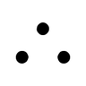
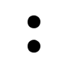
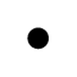

# Galeria de Glifos ELIS

Amostra dos glifos da fonte **ELIS** renderizados para análise de viabilidade tátil.
Cada imagem representa um glifo após o processo de binarização e avaliação
de conformidade com os critérios ISO 11548-2.

---

## Minúsculas

<div style="display:flex; flex-wrap:wrap; gap:1rem; margin-top:1rem;">

  <figure style="text-align:center; margin:0;">
    
    <figcaption><code>b</code></figcaption>
  </figure>

  <figure style="text-align:center; margin:0;">
    
    <figcaption><code>i</code></figcaption>
  </figure>

  <figure style="text-align:center; margin:0;">
    
    <figcaption><code>k</code></figcaption>
  </figure>

  <figure style="text-align:center; margin:0;">
    
    <figcaption><code>m</code></figcaption>
  </figure>

  <figure style="text-align:center; margin:0;">
    
    <figcaption><code>n</code></figcaption>
  </figure>

  <figure style="text-align:center; margin:0;">
    
    <figcaption><code>q</code></figcaption>
  </figure>

  <figure style="text-align:center; margin:0;">
    
    <figcaption><code>r</code></figcaption>
  </figure>

  <figure style="text-align:center; margin:0;">
    
    <figcaption><code>s</code></figcaption>
  </figure>

</div>

---

!!! info "Nota"
    As imagens desta galeria são amostras geradas pelo script
    `scripts/generate_glyph_images.py`. Para gerar todas as 145 imagens,
    execute:
    ```bash
    uv run python scripts/generate_glyph_images.py
    ```
