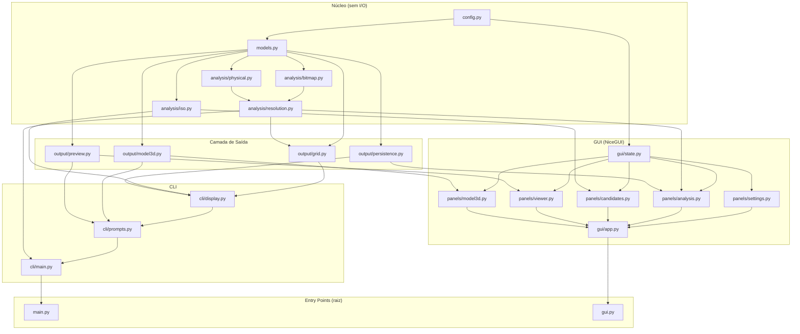

# Arquitetura — glifo-analise

## Decisão de Arquitetura

**Estilo:** Arquitetura em Camadas com Módulos Separados por Responsabilidade
(Layered / Modular Monolith).

Justificativa: o sistema é uma ferramenta de análise de dados, sem domínio de negócio
complexo. Clean Architecture ou Hexagonal adicionariam indireção desnecessária.
A divisão em camadas (`core → output → cli/gui`) já garante a testabilidade e a
independência da interface.

---

## Estrutura de Pacotes

```
glifo-analise/                    ← raiz do projeto
│
├── elis.ttf                      ← fonte ELIS (asset)
├── main.py                       ← shim CLI: `from glifo_analise.cli.main import main`
├── gui.py                        ← shim GUI: `from glifo_analise.gui.app import run`
├── pyproject.toml
├── specs/
│
├── output/                       ← artefatos gerados (PNG, STL, 3MF, JSON)
│
└── glifo_analise/                ← pacote principal
    ├── __init__.py
    │
    ├── config.py                 ← todas as constantes e grupos de glifos ELiS
    ├── models.py                 ← dataclasses: GlyphProfile, TactileVerdict,
    │                                ResolutionReport, ExtendedReport
    │
    ├── analysis/                 ← CAMADA NÚCLEO (pura, sem I/O)
    │   ├── __init__.py
    │   ├── bitmap.py             ← _render_bitmap, _pixel_density, _edge_complexity,
    │   │                            _iou, _effective_resolution, _system_font
    │   ├── physical.py           ← _physical_cell_size, _physical_cell_size_mn,
    │   │                            _sequence_capacity
    │   ├── resolution.py         ← _analyze_resolution, _analyze_resolution_ext
    │   └── iso.py                ← _iso_compliance
    │
    ├── output/                   ← CAMADA DE SAÍDA (I/O de artefatos)
    │   ├── __init__.py
    │   ├── grid.py               ← _save_grid
    │   ├── model3d.py            ← _generate_tactile_3d
    │   ├── preview.py            ← _generate_tactile_preview_png
    │   └── persistence.py        ← _save_candidates, _load_candidates
    │
    ├── cli/                      ← CAMADA CLI
    │   ├── __init__.py
    │   ├── display.py            ← _print_candidates_table, _print_candidate_detail,
    │   │                            _group_summary
    │   ├── prompts.py            ← _generate_from_saved, _prompt_tactile_3d
    │   └── main.py               ← main()
    │
    └── gui/                      ← CAMADA GUI (NiceGUI)
        ├── __init__.py
        ├── app.py                ← run(): configura NiceGUI, monta roteamento
        ├── state.py              ← AppState (configurações editáveis por sessão)
        └── panels/
            ├── __init__.py
            ├── settings.py       ← parâmetros psicofísicos + grupos ELiS
            ├── analysis.py       ← disparo de análise + log streaming
            ├── candidates.py     ← tabela interativa de candidatos
            ├── viewer.py         ← galeria de imagens PNG
            └── model3d.py        ← geração STL/3MF + download
```

---

## Diagrama de Dependências



---

## Decisões de Design

| Decisão | Justificativa |
|---------|---------------|
| `config.py` centraliza TODAS as constantes | GUI pode sobrescrever valores via `AppState` sem alterar o módulo; CLI usa os defaults. |
| `AppState` (dataclass mutável por sessão) | Permite que a GUI edite parâmetros sem side-effects no processo CLI. |
| Shims na raiz (`main.py`, `gui.py`) | Preserva 100% de backward-compatibility com `pyproject.toml` scripts e uso direto com `python main.py`. |
| Análise em thread separada na GUI | Evita bloquear o event loop do NiceGUI; progresso enviado via `ui.notify` / queue. |
| Módulo `output/` sem lógica de análise | `grid.py`, `model3d.py` e `preview.py` recebem dados prontos — fáceis de mockar em testes. |
