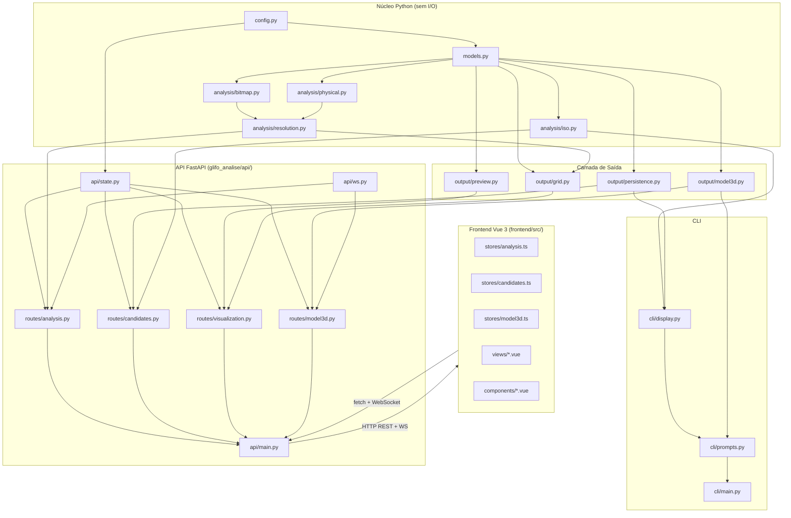

# Arquitetura — glifo-analise

## Decisão de Arquitetura

**Estilo:** Arquitetura em Camadas com Módulos Separados por Responsabilidade
(Layered / Modular Monolith) — núcleo Python inalterado + frontend desacoplado.

**GUI anterior (NiceGUI):** removida.
**Nova GUI:** Vue 3 (Vite) como SPA standalone; Python expõe REST + WebSocket
via FastAPI. A SPA compilada (`frontend/dist/`) é servida como arquivos estáticos
pelo próprio FastAPI.

---

## Estrutura de Pacotes

```
glifo-analise/                    ← raiz do projeto
│
├── elis.ttf                      ← fonte ELIS (asset)
├── main.py                       ← shim CLI: `from glifo_analise.cli.main import main`
├── pyproject.toml
├── specs/
│
├── output/                       ← artefatos gerados (PNG, STL, 3MF, JSON)
│
├── frontend/                     ← SPA Vue 3 + Vite (projeto Node separado)
│   ├── package.json
│   ├── vite.config.ts
│   ├── tsconfig.json
│   ├── index.html
│   ├── dist/                     ← build compilado (servido pelo FastAPI)
│   └── src/
│       ├── main.ts
│       ├── App.vue
│       ├── router/
│       │   └── index.ts          ← vue-router: /analysis /candidates /visualization /model3d
│       ├── stores/               ← Pinia
│       │   ├── analysis.ts
│       │   ├── candidates.ts
│       │   └── model3d.ts
│       ├── views/
│       │   ├── AnalysisView.vue
│       │   ├── CandidatesView.vue
│       │   ├── VisualizationView.vue
│       │   └── Model3DView.vue
│       ├── components/
│       │   ├── LogStream.vue     ← exibe linhas de log via WebSocket
│       │   ├── CandidateTable.vue
│       │   ├── ImageGallery.vue
│       │   ├── Viewer3D.vue      ← iframe Three.js (viewer3d.html)
│       │   └── ElisFontInput.vue ← input com fonte ELIS
│       └── assets/
│           └── elis.ttf
│
└── glifo_analise/                ← pacote Python principal
    ├── __init__.py
    │
    ├── config.py                 ← todas as constantes e grupos de glifos ELiS
    ├── models.py                 ← dataclasses: GlyphProfile, TactileVerdict,
    │                                ResolutionReport, ExtendedReport
    │
    ├── analysis/                 ← CAMADA NÚCLEO (pura, sem I/O)
    │   ├── bitmap.py
    │   ├── physical.py
    │   ├── resolution.py
    │   └── iso.py
    │
    ├── output/                   ← CAMADA DE SAÍDA (I/O de artefatos)
    │   ├── grid.py
    │   ├── model3d.py
    │   ├── preview.py
    │   └── persistence.py
    │
    ├── cli/                      ← CAMADA CLI (inalterada)
    │   ├── display.py
    │   ├── prompts.py
    │   └── main.py
    │
    └── api/                      ← CAMADA API (FastAPI — substitui gui/)
        ├── __init__.py
        ├── main.py               ← FastAPI app + montagem de routers + serve SPA
        ├── state.py              ← AppState (sessão em memória, thread-safe)
        ├── ws.py                 ← WebSocket manager (broadcast de progresso)
        └── routes/
            ├── __init__.py
            ├── analysis.py       ← POST /api/analysis/run  + GET /api/analysis/status
            ├── candidates.py     ← GET /api/candidates
            ├── visualization.py  ← POST /api/visualization/generate
            ├── model3d.py        ← POST /api/model3d/generate + GET /api/model3d/files
            └── files.py          ← GET /output/{filename} (servir artefatos)
```

---

## Diagrama de Dependências



---

## Fluxo de Comunicação

```
Vue 3 (browser)                   FastAPI (backend)
     │                                  │
     │  POST /api/analysis/run          │
     │ ────────────────────────────────>│
     │                                  │  run_in_executor (thread)
     │  WS  /api/ws/progress            │    └─ analysis core
     │ <────────────────────────────────│         └─ emite linhas de log
     │  { line: "...", pct: 42 }        │
     │                                  │
     │  GET /api/candidates             │
     │ ────────────────────────────────>│
     │  [{ rank, resolution, ... }]     │
     │ <────────────────────────────────│
     │                                  │
     │  POST /api/model3d/generate      │
     │ ────────────────────────────────>│
     │  WS: progresso 3D                │
     │ <────────────────────────────────│
     │  GET /output/tatil_...3mf        │
     │ ────────────────────────────────>│  arquivo estático
```

---

## Decisões de Design

| Decisão | Justificativa |
|---------|---------------|
| Núcleo Python inalterado | `analysis/`, `output/`, `cli/` não dependem de GUI. Migração sem risco de regressão nos testes existentes. |
| FastAPI em `glifo_analise/api/` | Mantém o pacote Python coeso; facilita importação do núcleo sem ajustes de PYTHONPATH. |
| Vue 3 + Vite em `frontend/` | Build separado; SPA compilada servida pelo FastAPI em `/`. Desacoplamento total frontend/backend. |
| Pinia para estado global | Stores tipadas por domínio (`analysis`, `candidates`, `model3d`); simples de testar isoladamente. |
| WebSocket para progresso | Operações longas (análise, geração 3D) enviam eventos linha a linha para atualização em tempo real. |
| Viewer3D como iframe estático | `viewer3d.html` (Three.js local) reutilizado via `postMessage({type:'loadModel'})` a partir de `Viewer3D.vue`. |
| `AppState` thread-safe em `api/state.py` | Protege estado compartilhado entre requests com `threading.Lock`. |
| CLI não é alterada | `uv run glifo-analise` continua 100% funcional e independente da GUI. |
